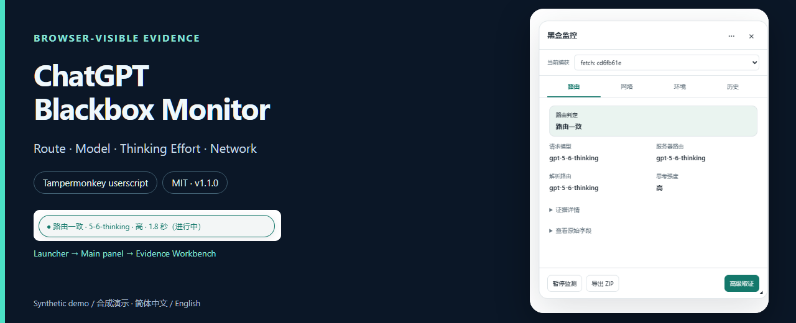
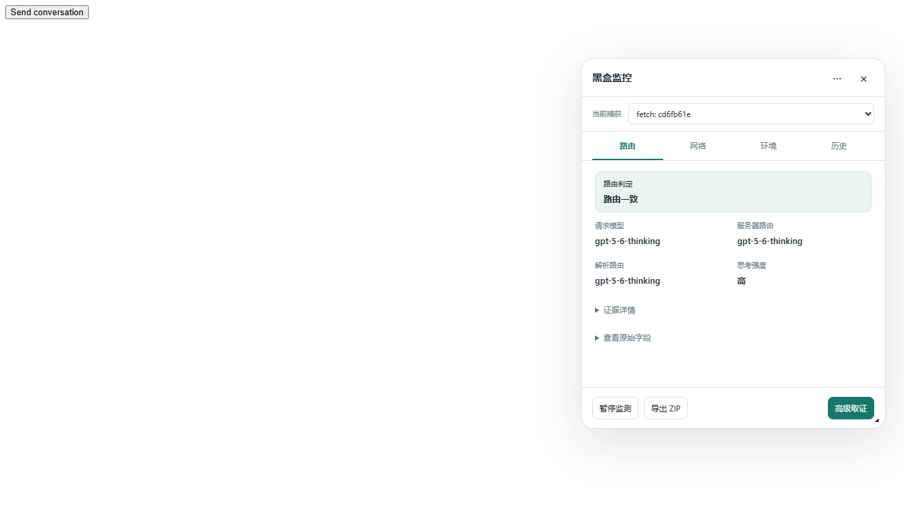
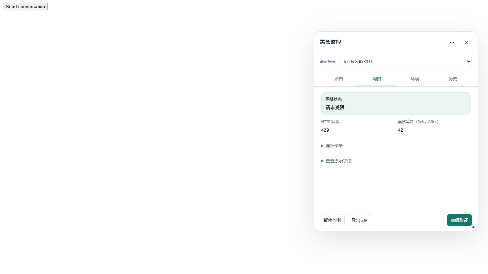

# ChatGPT Blackbox Monitor

在 ChatGPT 网页查看模型请求、公开路由、思考强度与网络证据的 Tampermonkey 用户脚本。

A Tampermonkey userscript for browser-visible ChatGPT routing, requested models, thinking effort and network debugging.

**[Install v1.1.0 / 下载脚本](https://github.com/karel244/chatgpt-blackbox-monitor/releases/download/v1.1.0/chatgpt-blackbox-monitor.user.js)** · [Latest Release](https://github.com/karel244/chatgpt-blackbox-monitor/releases/latest) · [Raw userscript](https://raw.githubusercontent.com/karel244/chatgpt-blackbox-monitor/main/dist/chatgpt-blackbox-monitor.user.js) · [Tampermonkey](https://www.tampermonkey.net/) · [Issues](https://github.com/karel244/chatgpt-blackbox-monitor/issues) · [Documentation](docs/USER_GUIDE.md)

  

下载 Release 脚本 → 在 Tampermonkey 安装/导入 → 刷新 ChatGPT，发送一条新消息。**简体中文 / English · 手动更新 / Manual updates**

- **Route / 路由**：公开声明的一致、冲突或未知。
- **Model / 模型**：请求模型及已观察到的服务器声明。
- **Thinking effort / 思考强度**：客户端请求声明。
- **Network / 网络**：HTTP、传输与异常诊断。
- **History / 本地历史**：查看与导出旧轮次。
- **Evidence / 证据**：时间线、脱敏 ZIP 与本地 A/B 对比。

**边界 / Limits:** Browser-observable evidence only. Cannot prove hidden model weights, GPU/worker assignment or hidden reasoning budget. 路由一致只表示已观察声明一致；Unknown 不等于降级。

## 安装 / Install

1. 安装并启用 [官方 Tampermonkey](https://www.tampermonkey.net/)。
2. 确认浏览器允许用户脚本。Chromium 上按当前设置开启 **Allow User Scripts** 或 **Developer Mode**；不同版本/浏览器的入口可能不同，见 [官方执行权限说明](https://www.tampermonkey.net/faq.php?ext=fcmf&q=Q209&updated=true&version=4.19.6175)。
3. 下载 [v1.1.0 Release 脚本](https://github.com/karel244/chatgpt-blackbox-monitor/releases/download/v1.1.0/chatgpt-blackbox-monitor.user.js)（[Raw 备用入口](https://raw.githubusercontent.com/karel244/chatgpt-blackbox-monitor/main/dist/chatgpt-blackbox-monitor.user.js)），在 Tampermonkey 管理面板的实用工具中从文件导入，确认保存并启用。使用者无需 Node、clone 或 build。
4. 打开/刷新 ChatGPT，发送一条新消息，查看页面上的小胶囊。

**在线安装 / Online install:** [production userscript Raw](https://raw.githubusercontent.com/karel244/chatgpt-blackbox-monitor/main/dist/chatgpt-blackbox-monitor.user.js)。若浏览器未打开 Tampermonkey 安装页，可下载后按上述方式从文件导入。

[Repository](https://github.com/karel244/chatgpt-blackbox-monitor) · [Issues](https://github.com/karel244/chatgpt-blackbox-monitor/issues) · [Releases](https://github.com/karel244/chatgpt-blackbox-monitor/releases)

没有入口时：检查 Tampermonkey 与脚本是否启用→检查用户脚本执行权限→刷新 ChatGPT。看到胶囊表示界面存在，不能单凭它证明所有捕获器已经就绪。

**English quick start:** Install official Tampermonkey, enable user-script execution as required by your browser, import the linked production `.user.js` from a file, then refresh ChatGPT and send a new message. Click the capsule to open the panel. Switch Language to English under **··· → Settings**. No build tools are needed. Download the v1.1.0 Release asset from the Install link above. If no Tampermonkey install screen opens, import the downloaded file manually. Raw is an alternative; automatic updates are not validated.

## 截图

以下来自性能修复版的 Chrome + official Tampermonkey 合成验收页，**是合成演示，不是登录态 ChatGPT 截图**；不含私人聊天或账号。

## 三步使用

**打开 ChatGPT → 发一条新消息并等回答 → 看胶囊；有异常或想看来源，再点击胶囊进入路由/网络。** 日常不需要打开高级取证。

## 怎么读 Launcher

| 四项 | 含义 |
|---|---|
| 路由状态 | 可见声明的一致、冲突或未知；网络异常优先显示 |
| 模型 | 优先服务器声明，再解析声明，再请求模型；完整值和来源在 tooltip |
| 思考强度 | 客户端请求声明，不等于隐藏 reasoning budget |
| 耗时 | 客户端可观察 elapsed/total；不等于内部真实推理时长，reload 无法恢复时可未知 |

模型标签不百分之百证明内部权重；Unknown 不等于降级。当前胶囊约 380×36，点击打开 Main，×回胶囊。

## Unknown / Partial / Conflict FAQ

- **为什么全是 Unknown？** 尚未产生可展示对话时，先发一条新消息。已有请求但服务器未公开足够且可靠关联的 A 级声明时，路由仍可能未知；再次发送不保证补齐。先看来源与证据详情，不当成故障或降级。
- **“部分完整”是什么？** 有可用证据但覆盖不全；原因可能涉及观察、关联、恢复或声明了的脱敏删除。看取证详情，不等于聊天回答不完整。
- **Conflict 是什么？** 同一轮观察到互相冲突的公开声明，工具保留来源，不擅自选赢家。
- **HTTP 429/403 是模型降级吗？** 不能据此证明。429 是请求受限，有 Retry-After 时参考服务器声明；403/挑战看 ChatGPT 页面自身提示。网络与模型路由分开判断。
- **为什么 Main 显示最近有效对话，Export 导出另一个？** 摘要展示不等于 Current selector。摘要可能参考同一 document 的最近有效对话；导出 ZIP 按顶部“当前捕获”，旧轮请到“历史”导出。没有当前捕获时不能凭摘要导出当前轮。
- **A/B/C/D 是什么？** A=可信关联范围内服务器公开路由，B=请求意图，C=assistant metadata，D=页面标签。C/D 不升级成 A。它们与高级区的 A/B 实验对比是不同概念。

English: Unknown means insufficient observed evidence, not a downgrade. An empty first run and a captured request without sufficient server declarations are different states. Partial means useful but incomplete coverage. Conflict means contradictory observed declarations. A recent display summary does not change Current capture or the export target.

## 路由 / 网络 / 环境 / 历史

Main 约 460×560，四个 Tab，默认**路由**：

- **路由**：先看判定，再看请求模型、服务器路由、解析路由和思考强度；技术来源在折叠的证据详情/原始字段。
- **网络**：正常先看状态与 HTTP；异常时挑战、重试等待、传输/WS 关键字段浮出，更多证据在详细诊断。
- **环境**：浏览器、可视区、DPR、时区、在线状态；build/hash 在技术详情，不是服务器算力指标。
- **历史**：先看时间、模型、路由、强度、耗时；↗ 导出那轮历史。Main 最近 20 轮，全部历史在 Workbench；有 200 conversation rounds、30 天、50 MiB 等多重预算，不保证永远留满 200 轮。

顶部“当前捕获”严格列本 document/visit/epoch 中仍在内存的对话轮次；旧范围或已释放轮次在 History。Main 的 recent 摘要只是显示参考。

## 控制：Pause / Close / Hide / Clear / Resize

- **暂停/继续**控制监测；**×关闭**回胶囊；**···→设置→隐藏**留下边缘恢复点，隐藏不暂停，点击恢复点回入口。
- 拖动胶囊或面板标题栏可移动并自动记位、防出界；没有移动/重置按钮，Tampermonkey 业务菜单为 0。
- 拖动 Main/Workbench 右下角可整体等比例缩放；聚焦缩放手柄后用方向键微调。两窗分别记忆 0.75–1.40 scale，胶囊与恢复点不缩放。
- **清除当前**：删除当前捕获的内存证据和该轮已保存历史。
- **清除历史**：删除已结束（Closed）的已保存记录，不清正在捕获的全部证据。
- **清除全部**：清除现有本地证据及实验数据，不暂停监测；之后可产生新的记录，含 environment/context_clear。语言、位置、缩放等 UI preferences 保留。Clear all 不等于“列表永久空”。
- 清除不可撤销；先导出要保留的内容。所有 Clear 都不会自动删除已下载到磁盘的 ZIP。

**高级取证**打开约 960×680 的非模态 Workbench，用于完整证据、时间线、A/B 比较和复杂排查；日常不需要打开。详见 [当前使用指南](docs/USER_GUIDE.md)。

## 隐私与导出

工具不持久保存完整 Prompt/Answer，不主动采集认证 Cookie/Authorization/token。请求/响应内容可能被瞬时解析以提取白名单字段。History/preferences 存在 Tampermonkey 本地存储；当前产品无 telemetry/自动上传路径。本地导入不上传、不执行包内容，也不写入捕获历史。

Evidence ZIP 包含 manifest、summary、timeline、network、environment、comparison 和安全报告，做 ID 映射与部分环境降粒度。**脱敏不等于绝对匿名**：仍可能包含时间、模型、路由、网络和环境线索；分享前人工检查。GM storage 不是加密保险库；产品声明不替 Tampermonkey 或浏览器同步功能作隐私保证。

“导出 ZIP”是该轮证据包；项目源码 ZIP 是仓库交付包，两者不同。SHA-256 校验完整性，不是服务器签名。

## 更新 / 卸载

**首次公开版采用手动更新**，自动更新未正式验证。后续从[官方 Releases](https://github.com/karel244/chatgpt-blackbox-monitor/releases)获取 production `.user.js`，核对 hash，在 Tampermonkey 导入/替换并刷新页面；安装时核对已有脚本，避免重复启用。当前 package、userscript 和导出 tool version 已统一为 `1.1.0`。

卸载：如需清理本地证据，先按实际 Clear 范围操作，再在 Tampermonkey 删除 userscript、刷新 ChatGPT。已下载 ZIP 自行删除；Hide/Pause 不清 GM 历史，Clear all 保留 UI preferences。

## 报 Issue

请在[官方 Issues](https://github.com/karel244/chatgpt-blackbox-monitor/issues)反馈问题。建议提供：脚本版本/hash、浏览器与版本、Tampermonkey 版本、语言、复现步骤、期望/实际结果，必要时提供裁去聊天区与账号信息的截图。

**不要上传 Cookie、Authorization、token、原始 HAR 或真实 Prompt/Answer。** Evidence ZIP 可选且分享前人工检查；疑似秘密不要公开提交。发布者需确定安全反馈渠道。

## 已验证范围 / Limitations

性能修复产品基线已通过 Chrome/Edge + official Tampermonkey 5.5.0 的合成捕获、UI、Unknown 长运行与 DOM 稳定性验收。功能逻辑未变；公开 metadata 更新后已重新通过 format/lint/typecheck、unit 141/141、integration 55/55、production build 与 synthetic build；公开测试集小于内部完整验收集，当前数量见[包装报告](docs/GITHUB_PUBLIC_RELEASE_PACKAGING_REPORT.md)。没有把基线浏览器结果当作新一轮登录态实测。

Real-user live smoke: preliminary positive feedback after performance-fixed RC.

Authenticated Chat/Work：**Not validated**。Native BFCache restore：**Not validated / Harness unavailable**。工程合成验收不等于所有登录态线上协议都通过。见 [已知限制](docs/KNOWN_LIMITATIONS.md)、[性能说明](docs/PERFORMANCE.md)。

## 开发与发布资料

- [用户指南](docs/USER_GUIDE.md) · [架构](docs/ARCHITECTURE.md) · [贡献说明](CONTRIBUTING.md)
- [发布清单](docs/GITHUB_RELEASE_CHECKLIST.md) · [仓库设置](docs/GITHUB_REPO_SETUP.md) · [Release Notes](docs/RELEASE_NOTES_v1.1.0.md)
- [来源审计](docs/LICENSE_AUDIT.md) · [隐私审计](docs/PUBLIC_REPO_PRIVACY_AUDIT.md) · [包装验证](docs/GITHUB_PUBLIC_RELEASE_PACKAGING_REPORT.md)

## License

**License: MIT.** 本项目采用 [MIT License](LICENSE)。[Repository](https://github.com/karel244/chatgpt-blackbox-monitor) 与[在线安装链接](https://raw.githubusercontent.com/karel244/chatgpt-blackbox-monitor/main/dist/chatgpt-blackbox-monitor.user.js)已确定。

来源审计已通过；项目 License 为 MIT。[v1.1.0 Release](https://github.com/karel244/chatgpt-blackbox-monitor/releases/tag/v1.1.0) 已发布。见[来源审计](docs/LICENSE_AUDIT.md)。
